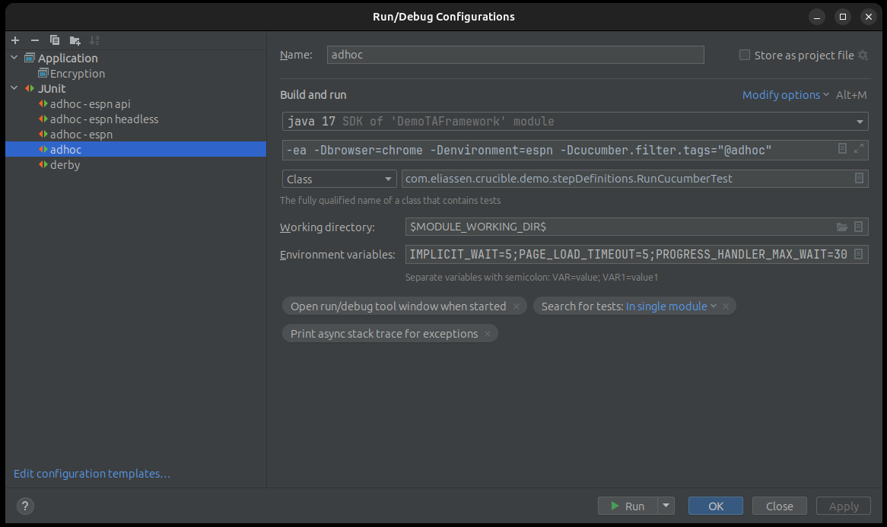

# Introduction
This is a Demo Framework for the Crucible Testing Framework.
Follow the examples provided here to setup your own client framework.

# Key concepts
## Casing
There are several casing rules followed throughout the framework. The default is camel-case.  
Lowercase is used in most feature files.

## Environments
Environments are an abstract concept and are not explicitly defined. This means there are no compulsory parts that are required to be setup for each environment.
An environment can consist of
- Users
- Urls (for both front-end sites and Api endpoints)
- One or more Connection Strings

### Example
You might use Crucible to test a Database application (i.e. queries, stored procedures, etc.). In this case, you need one or more Connection Strings, and probably one or more Users, but you would not need to define any Urls

## Resource Files
Resource files can be found in the Main Resources folder.  


### Users.json
Users.json is organized by-environment and by-user.

The concept of a User is abstract. To prevent you from having to have Feature files (or other tests) defined by environment because there are different users defined in different environments, abstract users are defined here.  
For instance, you might have a concept of an "admin" user in each environment. The usernames and passwords will most likely differ by environment, but the concept of an "admin" user will be the same as far the test is concerned.

```Cucumber
I login as the admin user
```

The framework will look in Users.json for the definition of the admin user for the environmental context you have chosen to execute the test with.

#### Passwords
either an encrypted password or a plain-text password can be set.  
The "encryptedPassword is encrypted at-rest, and will be decrypted at runtime.
The "password" is always in plain text.

To encrypt or decrypt a password, see Encryption

#### Default
If Crucible cannot locate a user definition for a particular environmental context, it will utilize one defined in "default" if it exists.

  
In this example you can see there is a "user" user defined in both the local and default environments. If you run a test in any environment besides local, the default will be used.

# Building and running the client framework
A Crucible client framework can be run in several different ways.
* Through an IDE using run or debug configurations
* From the command line using Maven
* Building an executable Jar and executing as an application  

## Running a Client Framework in an IDE
NOTE: Examples provided here are from IntelliJ. there is no guidance currently available for any other IDE.  
  
The client framework runs is a behavioral testing framework that utilizes Cucumber. Because of this, you should install helpful cucumber plugins to assist with the development of it and for doing day-to-day execution and testing. But please note: **the framework is not designed to be executed through the functionality provided by any of these Cucumber Runners.**  
Key information needed by the framework will be missing, such as the environmental context, the browser to execute in, and Tags for the run. While you may find detours around this perceived handicap, this is by design and not an oversight. **Use any of the Cucumber Execution functionality at your own risk.**  
  
The recommended way to execute the framework is by creating a JUnit run configuration  
  
### key points about the Run Config
* RunCucumberTest is the Junit runner class included in the framework. Look for documentation on how to extend this for your specific client framework.
* **Parameters**
  * **browser** is the browser where you want the framework to execute your tests. The types are defined in the Crucible Web library. the default is Chrome (i.e. if you do not include this parameter, it will choose to run in Chrome)
  * **environment** is the Environmental Context you have defined (see above). There is no default, but it can be defined using an Environment variable.
  * **cucumber.filter.tags** is where you put the Cucumber expression used to choose which tests to execute. If you leave this either blank or do not include it, the framework will attempt to run **ALL** your scenarios.
* **Environment Variables**
  * **IMPLICIT_WAIT** is the max amount of time a Selenium action is allowed to wait before throwing a timeout exception. It is in whole seconds. The default is 5.
  * **PAGE_LOAD_TIMEOUT** is a special timeout specifically for waiting for the page to load. This does not guarantee the page is FULLY loaded, just that it has resolved. In whole seconds and the default 


