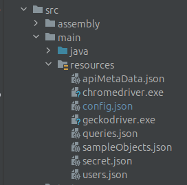
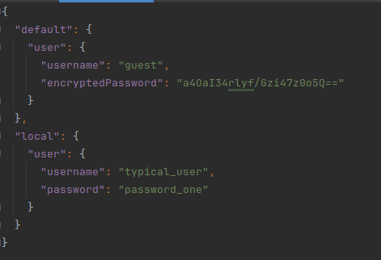

# Introduction
This is a Demo Framework for the Crucible Testing Framework.
Follow the examples provided here to setup your own client framework.

# Key concepts
## Casing
There are several casing rules followed throughout the framework. The default is camel-case.  
Lowercase is used in most feature files.

## Environments
Environments are an abstract concept and are not explicitly defined. This means there are no compulsory parts that are required to be setup for each environment.
An environment can consist of
- Users
- Urls (for both front-end sites and Api endpoints)
- One or more Connection Strings

### Example
You might use Crucible to test a Database application (i.e. queries, stored procedures, etc.). In this case, you need one or more Connection Strings, and probably one or more Users, but you would not need to define any Urls

## Resource Files
Resource files can be found in the Main Resources folder.  

### Users.json
Users.json is organized by-environment and by-user.

The concept of a User is abstract. To prevent you from having to have Feature files (or other tests) defined by environment because there are different users defined in different environments, abstract users are defined here.  
For instance, you might have a concept of an "admin" user in each environment. The usernames and passwords will most likely differ by environment, but the concept of an "admin" user will be the same as far the test is concerned.

``I login as the admin user``

The framework will look in Users.json for the definition of the admin user for the environmental context you have chosen to execute the test with.

#### Passwords
either an encrypted password or a plain-text password can be set.  
The "encryptedPassword is encrypted at-rest, and will be decrypted at runtime.
The "password" is always in plain text.

To encrypt or decrypt a password, see Encryption

#### Default
If Crucible cannot locate a user definition for a particular environmental context, it will utilize one defined in "default" if it exists.

  
In this example you can see there is a "user" user defined in both the local and default environments. If you run a test in any environment besides local, the default will be used.

