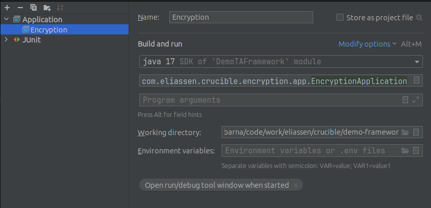
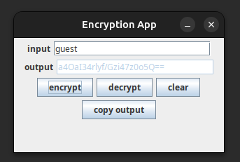
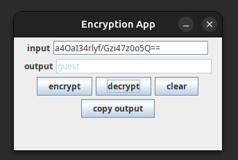

### Overview

Crucible's Encryption library is designed to simplify the process of encrypting and decrypting strings using the AES encryption algorithm. It provides a straightforward way to secure sensitive data by encrypting it with a secret key stored in a JSON file. This facilitates encrypting data at-rest, and decrypting it on the fly.

### Features

*   **AES Encryption**: Utilizes the AES (Advanced Encryption Standard) algorithm for secure encryption and decryption.
*   **Secret Key Management**: Derives a secret key from a provided string using SHA-1 hashing and stores it securely.
*   **JSON Configuration**: Retrieves the secret key from a JSON file specified by the `SECRET_PATH` constant.

### Usage

To use the `EncryptionHelper` class, follow these steps:

1.  Ensure you have a JSON file at the path specified by `SECRET_PATH` (default is "secret.json") containing your secret key with the key name `KEY_NAME` (default is "cryptKey").
2.  Call the `encryptString` method to encrypt a string, passing the string to be encrypted as an argument.
3.  Call the `decryptString` method to decrypt an encrypted string, passing the encrypted string as an argument.

### Example

```java
public class Main {
    public static void main(String[] args) {
        String originalString = "Sensitive Data";
        String encryptedString = EncryptionHelper.encryptString(originalString);
        System.out.println("Encrypted: " + encryptedString);

        String decryptedString = EncryptionHelper.decryptString(encryptedString);
        System.out.println("Decrypted: " + decryptedString);
    }
}

```

### Security Considerations

*   **Secret Key Storage**: Ensure the JSON file containing the secret key is stored securely and not committed to version control.
*   **Key Generation**: The secret key is generated using SHA-1 hashing. Consider using a more secure hashing algorithm if required.

### Key generation
The encryption key, used by both encryption and decryption, should be in a file entitled "secret.json" and located in the src/main/java/resources folder of the client framework. If not, it will be missed when you build a Jar.  
This is the expected structure of secret.json: 
```json
{
  "cryptKey": "value"
}
```
The key can be any string. It will be used to create the actual security key. This same key is required for both encryption and decryption. Anything encrypted with this key can be decrypted by another process using this library and this key.  
This library does not support storing or retrieving keys from vaults, local or cloud.

### Encryption Application
There is a simple app included in the library for manually encryption and decryption of strings.  
It is suggested you setup a run configuration like this to run it.


It is designed to be simple and easy to use.

#### Encrypting using the app
If you are encrypting a string, place the unencrypted string in the **input** field and hit the **encrypt** button. The encrypted string will appear in the **output** field. Hit the **copy output** button to place it in your clipboard.


#### Decrypting using the app
If you are decrypting a string, place the encrypted string in the **input** field and hit the **decrypt** button. The decrypted string will appear in the **output** field. Hit the **copy output** button to place it in your clipboard.


### Code Quality and Maintenance

The `EncryptionHelper` class is designed to be simple and easy to maintain. However, it's essential to keep the underlying encryption algorithm and secret key management up to date with the latest security standards.  

**TODOs**
*   Upgrade the Encryption to SHA-256
